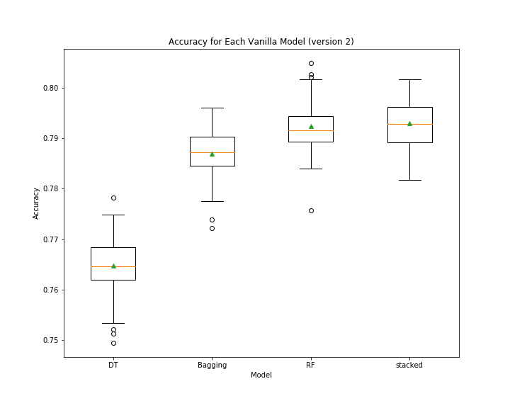
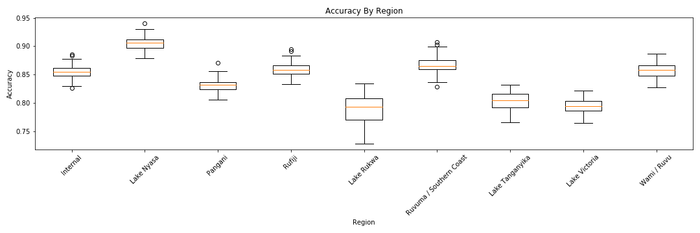
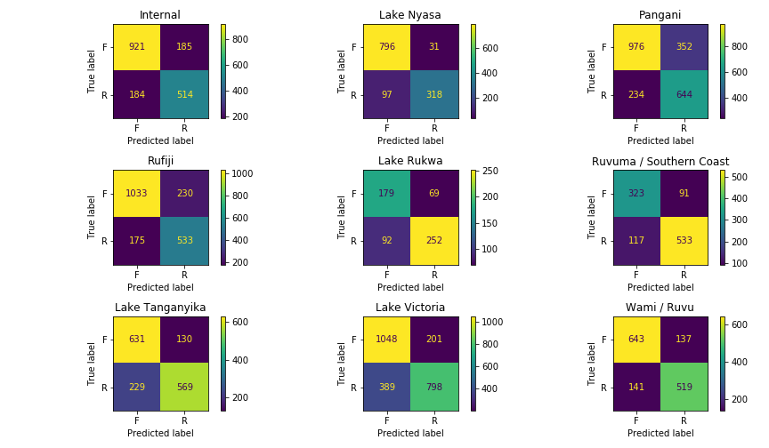

# Tanzania Water-Well Repairs 

### Authors 
- [Samuel Mohebban](https://github.com/HeeebsInc) and [Jake Miller Brooks](https://github.com/HeeebsInc/TanzaniaWaterRepair/commits?author=jmillerbrooks)
### Business Questions 
- Can water-well tracking in Tanzania be automated? 
- If so, how much money would this automation save the Tanzanian government? 
- How would this be beneficial for the Tanznaian population? 

### Initial Approach 
- Because there are various features in the dataset (~53), we initially approached our model using a stacked classifier.  Our hope was that a stacked classifier would allow us to learn different pattersnw within the dataset 
- Seeing that the stacked classifier did poorly comapred to the random forest, we decided to use just a random forest for our predictions 

### Random Forest
- We performed a random forest on each basin to determine whetehr accuracy, precision, or recall changed when given a smaller and more precise dataset 

## Conclusion 
- Median Salary in Tanzania → $20,699 (~$80 per/day)
- Number of Known Wells →  57,247
- Assuming each well requires a single person to go check and can take up to an entire day, and that each well is checked at least once every year, automating this process can save the Tanzanian government approximately **$4,579,760**  per year
