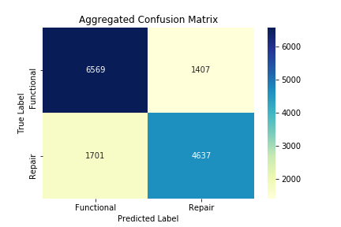
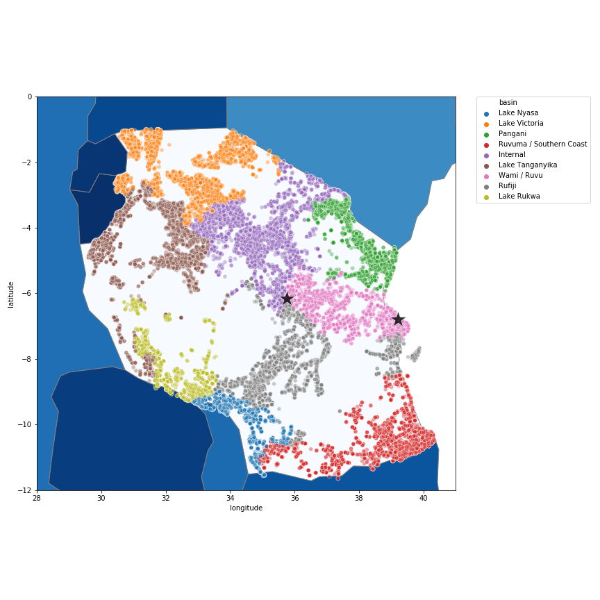

# Tanzania Water-Well Repairs 

### Authors 
- [Samuel Mohebban](https://github.com/HeeebsInc) and [Jake Miller Brooks](https://github.com/jmillerbrooks)
- [Google Slides Presentation](https://docs.google.com/presentation/d/1r0bV_F9mTsyee_Qof-4VhtH0wnv4N9ziCK-c1IvttYM/edit?usp=sharing)

### Data 
- [Pump it Up: Data Mining the Water Table](https://www.drivendata.org/competitions/7/pump-it-up-data-mining-the-water-table/page/23/)

### Business Questions 
- Can water-well tracking in Tanzania be automated? 
- If so, how much money would this automation save the Tanzanian government? 
- How would this be beneficial for the Tanznaian population? 

### Initial Approach 
- Because there are various features in the dataset (~53), we initially approached our model using a stacked classifier.  Our hope was that a stacked classifier would allow us to learn different patterns within the dataset
- We first scaled the following numeric columns (amount_tsh, gps_height, population, time_passed) with a standard scaler
- The models we included in the stacked ensemble were:
    Logistic Regression
    KNearest Neighbors
    Decision Tree
    Gaussian Classifier
    Linear Discriminant Analysis
    LinearSVC
    SDGSVC
    ADA
    Bagging
    Ridge
    Random Forest
    
- To evaluate the performance of each model, we used a stratified k-fold on the full set.
- Seeing that the stacked classifier did not perform significantly better compared to the random forest classifier, we decided to use just a random forest for our predictions
- [code](Notebooks/Modeling-Entire.ipynb)

### Random Forest
- We performed a random forest on each basin to determine whether accuracy, precision, or recall changed when given a smaller and more precise dataset 
- 78% Correct Predictions
- 22% Incorrect Predictions
- [code](Notebooks/Modeling-ByBasin.ipynb)

## Conclusion 
- Median Salary in Tanzania → $20,699 (~$80 per/day)
- Number of Known Wells →  57,247
- Assuming each well requires a single person to go check and can take up to an entire day, and that each well is checked at least once every year, automating this process can save the Tanzanian government approximately **$4,579,760**  per year

